# DenoiseNet (1D)

**DenoiseNet** is a 1D Convolutional Autoencoder designed for Ultrasonic Guided Wave (UGW) signal denoising. It leverages **Residual Learning** and an **Encoder-Decoder** architecture to predict and subtract noise from the input signal.

## Architecture

```mermaid
graph LR
    %% Styles
    classDef input fill:#e1f5fe,stroke:#01579b,stroke-width:2px;
    classDef conv fill:#ffecb3,stroke:#ff6f00,stroke-width:2px;
    classDef pool fill:#ffe0b2,stroke:#e65100,stroke-width:2px;
    classDef deconv fill:#e1bee7,stroke:#4a148c,stroke-width:2px;
    classDef op fill:#cfd8dc,stroke:#455a64,stroke-width:2px;

    %% Nodes
    subgraph Input ["Input Layer"]
        In(Noisy Signal<br/>1x1024)
    end

    subgraph Encoder ["Encoder"]
        direction TB
        E1[Conv1d<br/>k=7, c=64]:::conv
        P1[MaxPool<br/>k=2]:::pool
        E2[Conv1d<br/>k=5, c=128]:::conv
        P2[MaxPool<br/>k=2]:::pool
    end
    
    subgraph Bottleneck ["Bottleneck"]
        B1[Conv1d<br/>k=3, c=128]:::conv
    end

    subgraph Decoder ["Decoder"]
        direction TB
        D1[ConvT1d<br/>k=4, c=64]:::deconv
        D2[ConvT1d<br/>k=4, c=1]:::deconv
    end

    subgraph Output ["Residual Block"]
        Noise(Predicted Noise)
        Sub((Subtract)):::op
        Out(Clean Signal)
    end

    %% Flow
    In --> E1 --> P1 --> E2 --> P2 --> B1
    B1 --> D1 --> D2 --> Noise
    In -.-> Sub
    Noise --> Sub --> Out
```



### Core Principles

1. **Residual Learning**: The model predicts the noise distribution $\hat{v}$ rather than the clean signal directly.
    $$ \hat{x} = y - \text{DenoiseNet}(y) $$
    This takes advantage of the fact that noise typically has a simpler statistical distribution than the clean guided wave signal.

2. **1D Processing**: Operates directly on the time-domain signa, making it efficient for real-time applications.

## Usage

### Training

To train the model using the default configuration:

```bash
python src/scripts/train_denoisenet.py --epochs 100
```

### Inference

```python
from src.models.denoisenet_1d import DenoiseNet
import torch

# Initialize
model = DenoiseNet()
model.load_state_dict(torch.load('checkpoints/denoisenet/best_model.pt'))
model.eval()

# Denoise
noisy_signal = torch.randn(1, 1, 1024)
with torch.no_grad():
    clean_signal = model(noisy_signal)
```
