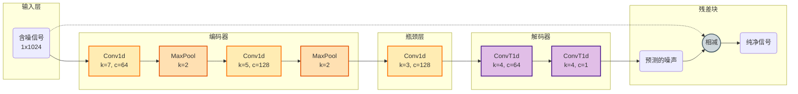

# DenoiseNet (1D)

**DenoiseNet** 是一个专为超声导波 (UGW) 信号去噪设计的 1D 卷积自编码器 (Convolutional Autoencoder)。它利用 **残差学习 (Residual Learning)** 和 **编码器-解码器 (Encoder-Decoder)** 架构来预测并从输入信号中减去噪声。

## 架构 (Architecture)



### 核心原理 (Core Principles)

1. **残差学习 (Residual Learning)**: 模型预测噪声分布 $\hat{v}$ 而不是直接预测纯净信号。
    $$ \hat{x} = y - \text{DenoiseNet}(y) $$
    这利用了噪声通常比纯净导波信号具有更简单的统计分布这一特性。

2. **1D 处理**: 直接在时域信号上操作，使其高效且适用于实时应用。

## 使用方法 (Usage)

### 训练 (Training)

使用默认配置训练模型：

```bash
python src/scripts/train_denoisenet.py --epochs 100
```

### 推理 (Inference)

```python
from src.models.denoisenet_1d import DenoiseNet
import torch

# 初始化
model = DenoiseNet()
model.load_state_dict(torch.load('checkpoints/denoisenet/best_model.pt'))
model.eval()

# 去噪
noisy_signal = torch.randn(1, 1, 1024)
with torch.no_grad():
    clean_signal = model(noisy_signal)
```
