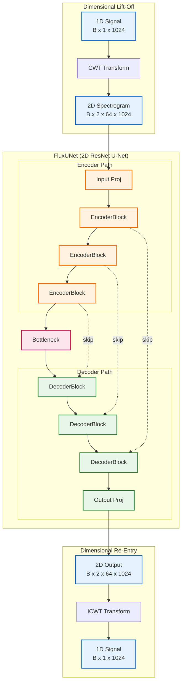

# FluxUNet (Signal-to-Image)

**FluxUNet** is a **Dimensional-Fluid** architecture that denoises 1D signals by transforming them into 2D time-frequency spectrograms. It uses a **U-Net** architecture with **ResNet** backbones to process complex Continuous Wavelet Transform (CWT) coefficients.

## Architecture



### Core Principles

1. **Dimensional-Fluidity**: Seamlessly transitions between 1D signal space and 2D time-frequency space.
2. **Phase Preservation**: Processes both Real and Imaginary CWT components (2 channels) to preserve phase information crucial for accurate reconstruction.
3. **Combined Loss**: Trained with a multi-objective loss function:
    $$ L_{total} = L_{MSE} + 0.5 \cdot L_{Spectral} + 0.1 \cdot L_{Phase} $$

## Usage

### Training

```bash
python src/scripts/train_flux.py --epochs 100
```

### Inference

```python
from src.models.flux import FluxUNet
from src.core.transmuters import DimensionalTransmuter
import torch

# Initialize
transmuter = DimensionalTransmuter(fs=6.25e6)
model = FluxUNet(in_channels=2, base_channels=64)
model.eval()

# Lift-off -> Denoise -> Re-entry
signal = ... # numpy array
coeffs, meta = transmuter.lift_off(signal) 
with torch.no_grad():
    pred_coeffs = model(torch.from_numpy(coeffs))
denoised_signal = transmuter.re_entry(pred_coeffs.numpy(), meta)
```
