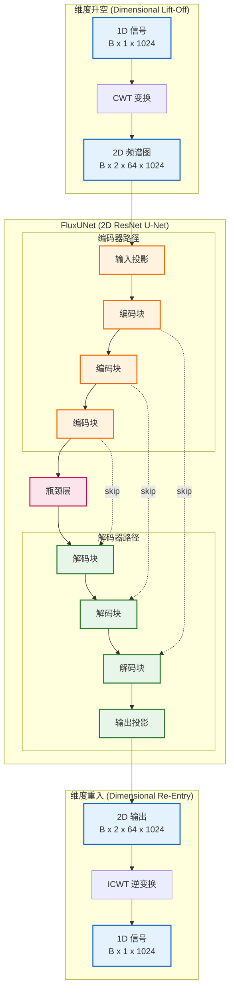

# FluxUNet (信号转图像)

**FluxUNet** 是一种 **维流体 (Dimensional-Fluid)** 架构，通过将 1D 信号转换为 2D 时频频谱图进行去噪。它使用带有 **ResNet** 骨干的 **U-Net** 架构来处理复杂的连续小波变换 (CWT) 系数。

## 架构 (Architecture)



### 核心原理 (Core Principles)

1. **维度流动性 (Dimensional-Fluidity)**: 无缝切换 1D 信号空间和 2D 时频空间。
2. **相位保留 (Phase Preservation)**: 处理 CWT 的实部和虚部（2 通道）以保留对精确重建至关重要的相位信息。
3. **混合损失 (Combined Loss)**: 使用多目标损失函数进行训练：
    $$ L_{total} = L_{MSE} + 0.5 \cdot L_{Spectral} + 0.1 \cdot L_{Phase} $$

## 使用方法 (Usage)

### 训练 (Training)

```bash
python src/scripts/train_flux.py --epochs 100
```

### 推理 (Inference)

```python
from src.models.flux import FluxUNet
from src.core.transmuters import DimensionalTransmuter
import torch

# 初始化
transmuter = DimensionalTransmuter(fs=6.25e6)
model = FluxUNet(in_channels=2, base_channels=64)
model.eval()

# 升空 -> 去噪 -> 重入
signal = ... # numpy array
coeffs, meta = transmuter.lift_off(signal) 
with torch.no_grad():
    pred_coeffs = model(torch.from_numpy(coeffs))
denoised_signal = transmuter.re_entry(pred_coeffs.numpy(), meta)
```
